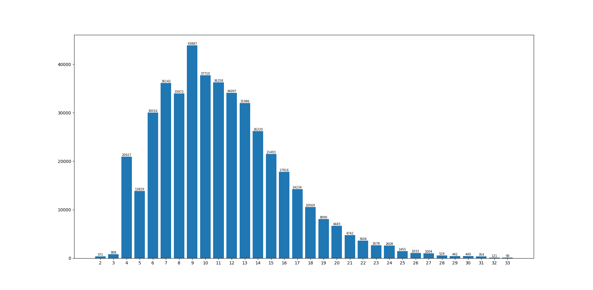
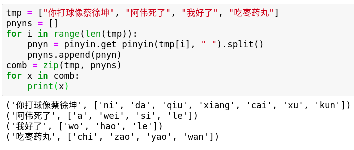
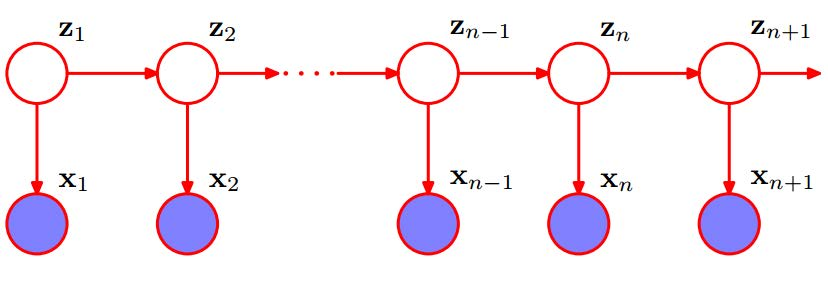
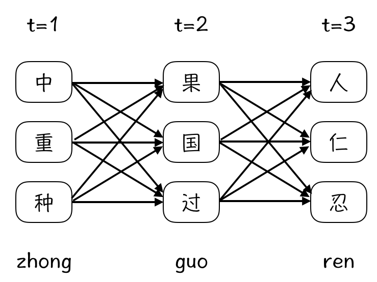
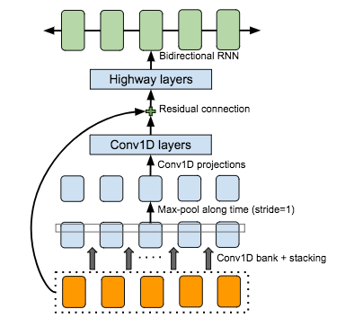
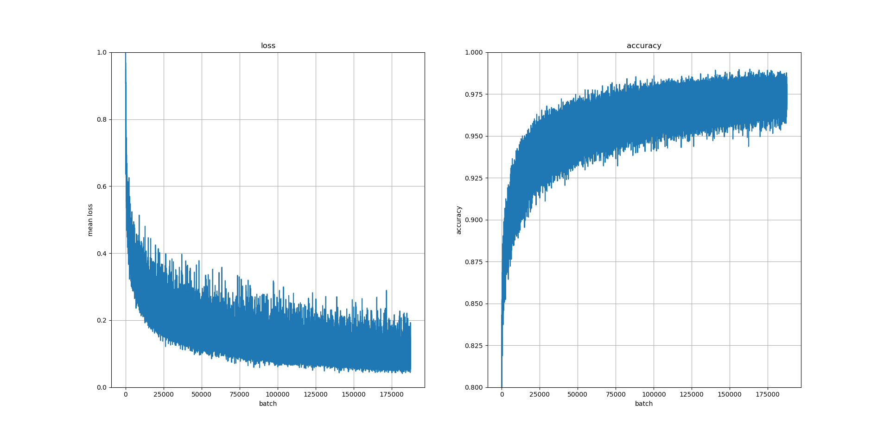

# <center>基于 Seq2Seq 模型的中文输入法</center>

<center>罗翔 17307130191</center>
[toc]

## 选题背景

　　我的主力系统是 Ubuntu，一般来说，每次配置环境时必不可少的是安装搜狗输入法 (Sougou for Linux)。随着搜狗输入法使用时间的增长，其开始明显带有用户特性，即根据用户输入习惯提供相应推荐。以输入”我是猪“为例，最开始键入简拼 "我是猪"时，前五项推荐中并没有”我是猪“的选项，当输入一次全拼的”我是猪“后，再次输入简拼时，即可看见”我是猪“的选项，显然搜狗输入法的背后是数据驱动的算法 (搜集用户使用输入法的记录，并据此推荐)。


　　这在带来便利的同时，也可能存在安全隐患，2018 年曾爆出百度和搜狗输入法在联网状态下会上传用户的输入信息到服务器，并且全部为明文传输[^1]，也即意味着黑客可以轻松获取用户全部输入信息。因此如果能够自己实现一个中文输入法，在贴合用户习惯的同时，实现数据的本地化，那么用户的隐私安全也会有相应保障。基于此，我借用已经实现的基于 Seq2Seq 模型的根据输入拼音预测相应汉字的项目[^2] (并做部分改动)，并与传统的基于 HMM 模型的方法作比较。

　　因文件过大，并未将源代码一起打包，所有源代码现已上传至我的 Github[^3]。

## 数据处理

### 数据集搜集

　　本次训练使用的数据为 2018 年 5 月在今日头条客户端抓取的 38+ 万条新闻[^4]。格式如下：

```
6552431613437805063_!_102_!_news_entertainment_!_谢娜为李浩菲澄清网络谣言，之后她的两个行为给自己加分_!_佟丽娅,网络谣言,快乐大本营,李浩菲,谢娜,观众们
```

　　每行为以`_!_`分割若干个字段的一条数据，从前往后依次为新闻 ID，分类 code，分类名称，新闻字符串 (仅含标题)，新闻关键词。首先通过正则表达式提取字符串 (标题)：


　　提取出的字符串用正则表达式将带有英文字母和数字的新闻过滤，根据标点符号将新闻内容分段 (考虑到用户真实使用输入法时，不会输入一句长几十个字并且带标点符号的拼音)。


　　处理后共获得 44+ 万条短句，长度分布如图所示：



### 汉字 to 拼音

　　本次任务对数据集没有任何要求，只需要有拼音及其对应的汉字即可。得到汉字后，可以通过 python 的 xpinyin 库直接将汉字翻译成拼音，事例如下：



　　将正则表达式处理后的内容，以编号-拼音-汉字的格式输出，并且对汉字做 padding，使得汉字与对应拼音等长，格式如下。

```
1	jingchengzuizhidenilaichangwenhuazhilvdebowuguan	京___城____最__值__得_你_来__场____文__化__之__旅_的_博_物_馆___
```

### Cross Validation

　　将得到的数据用 shuf 指令打乱顺序 (听说命令行比 python 快很多)，然后把 40 万条数据作为训练集，剩余 4+ 万条作为测试集。考虑后续训练时会用 batch 模式，将数据根据拼音的长度进行排序 (让长度相近的内容在同一个 batch 中，减少 padding 对模型学习的影响)。

```shell
shuf input.tsv -o input_shuf.tsv
```

## Baseline

　　相关代码在 HMM 文件夹下。

### HMM

　　HMM（Hidden Markov Models，隐马尔科夫模型）是一种基本的统计模型。它的前提是马尔科夫假设，即模型的当前状态仅依赖于前几个状态。一个马尔科夫过程是指状态间的转移仅依赖于前 *n* 个状态的过程 (*n* 阶马尔科夫模型)，其中 *n* 是影响下一个状态选择的前 *n* 个状态。

　　使用 HMM 模型时，通常问题有以下两个主要特征：

- 问题是基于序列的，如时间序列、状态序列；
- 问题中有两类数据，一类数据序列是可以观测到的，即观测序列，另一类数据序列是不能观测到的，即隐藏状态序列，简称状态序列；

　　在拼音输入法任务中，可以将汉字作为隐藏状态，而拼音作为观测值，显然，观测序列与隐藏过程具有一定的概率关系。



　　可以参考上图[^5]，其中 $Z_i$ 为隐藏状态序列，$X_i$ 为隐藏状态生成的观测状态序列。隐藏状态序列 $Z_i$ 满足马尔科夫过程的要求，且观测状态序列 $X_i$ 与 $Z_i$ 之间存在概率关系，而模型中的 $X_i$ 与 $X_{i+1}$ 是存在关联的 ($Z_i$ 与 $Z_{i + 1}$ 同样存在关联)。

　　因此我们可以将输入法问题抽象为 HMM 模型中的第三类问题——解码 (预测)问题，运用 Viterbi 算法将多个拼音转换成合理的汉字。例如输入`zhong,guo,ren`，Viterbi 算法会认为`中国人`是最合理的状态序列，如图所示[^5]



　　Viterbi 算法到达状态 $X$ 的最佳路径概率计算方式为：
$$
P(X_t) = \max_{i = A,B,C} P(i_{t - 1}) \times P(X | i_{t - 1}) \times P(\mbox{observation}_t | X)
$$
　　其中，$P(i_{t - 1})$ 是 t-1 时刻的局部概率 $\delta_{t - 1}$，$P(X | i_{t - 1})$ 是状态转移概率，$P(\mbox{observation}_t | X)$ 是 t 时刻的观测概率。

　　而导致当前状态最优概率的前一时刻的某个状态则由如下公式得出：
$$
\phi_t(i) = \mathop{\mbox{argmax}}_j(\delta_{t - 1}(j)P_{ji})
$$
　　HMM 需要三个分布 (3 个分布就是 3 个矩阵，可以根据文本库统计出来)，分别是：

- 初始时各个状态的概率分布
- 各个状态互相转换的概率分布
- 状态到观测值的概率分布

　　当依据训练集 (以及先验的词语频率分布[^7])建立好分布信息后，即可由 Viterbi 算法在测试集上预测拼音对应的汉字，因而可以省去深度学习网络中的大量训练过程。

### 分段

　　在实际使用输入法时，比如键入`zhongguoren` (拼写`中国人`)时，用户并不会将拼音分段，因此需要输入法自行处理分段，然后根据分段得出的拼音运用 Viterbi 算法预测对应的汉字。

　　我们采用最长匹配：如果当前用户输入的字符串构成合法拼音或者某个拼音的前缀，那么我们继续向后匹配，直到当前输入字符（假设是第n个）与前 n-1 个字符无法构成合法的拼音或拼音的前缀，那么停止匹配。接下来考虑当前输入字符可否构成某个拼音的前缀，若可以，则将前面长为 n-1 的字符串切分成拼音，从第 n 个字符开始继续匹配；否则向前搜索直到当前 n 个字符可以分割为一个长为 i 的合法拼音以及一个长为 n-i 的可构成合法拼音或者拼音前缀的字符串。

　　显然这需要专门建立一个映射来判断字符串是否为合法拼音或拼音前缀 (PnynSplit.py)，此处我们借鉴了 Github 上的一个输入法项目[^6]中的分段部分 (原 repo 缺少大量前缀判别)并在此基础上改进。

## Seq2Seq 模型

　　相关代码在 Neural Translation 文件夹下。

　　在进入 CBHG 模块之前，先对输入做 embedding (vocab_size = 4008，embed_size = 300)以提取特征。

### CBHG

　　模型先使用一系列的一维卷积网络，filter_size 从 1 到 K (设为 16)，形成一个 Conv1D Bank，相当于使用了一系列的 unigrams, bigrams, ..., K-grams，尽可能多的拿到输入序列从 local 到 context 的完整信息。

　　模型在最终的 BiGRU 之前加入了多层的 Highway Layers，用来提取更高层次的特征。Highway Layers 可以理解为加入本来不相邻层之间的“高速公路”，让梯度更好地向前流动；同时又加入一个类似 LSTM 中门的机制，自动学习这些高速公路的开关和流量。
$$
y = H(x, W_H) \bigodot T(x, W_T) + x \bigodot C(x, W_C)
$$
　　T 是 transform gate，C 是 carry gate，C 和 T 的激活函数都是 sigmoid 函数。这样即使层数很多也可以使用简单的方法比方说 backpropogation 来进行训练，保证合理的迭代范围内收敛，而传统的网络是很难保证收敛的。

　　模型中还使用了 Batch Normalization (继 ReLU 之后大家公认的 DL 训练技巧)，Residual Connection (通过加入 residual block，跳出局部最优点，避免随网络层数增加，训练集上的效果变差)，Stride=1 的 Max-pooling (保证 Conv 的局部不变性和时间维度的粒度) 以及一个 BiGRU。



### Grading

　　因为对每个汉字做了 padding，而实际训练时只需预测出相应位置处的汉字即可，所以可以先对预测结果做 masking，然后再得出相应的 Loss 和 Accuracy。


　　在 test 时，使用 Levenshtein.distance(str1, str2)，计算预测结果与目标之间的编辑距离，即一个字符串转化成另一个字串最少的操作次数 (包括插入、删除、替换)。

## 实验

　　运用 Seq2Seq 模型在训练集上以 batch_size = 64、epoch = 30 训练后，得到的结果如下：



　　ＨＭＭ 模型在测试集上的预测速度显著慢于深度学习网络 (HMM 在测试集上完成预测需要两小时以上，Seq2Seq 模型只需要两分钟不到)，考虑 HMM 模型在处理每个字符串时，都需要先分段，然后由 Vitertbi 算法求得每个状态值，即使通过剪枝处理，每个状态也需要遍历整个可能的状态空间，而深度学习网络则可以通过 batch 方式来实现均摊。

　　HMM 模型在测试集上的准确率 (Levenshtein 距离为0) 为38.85%；而 Seq2Seq 则达到 62.19%，平均 Levenshtein 距离相较原项目也有了部分提升(考虑到我们对 batch 内容做了优化，并且对长句分段)。

| Kyubyong‘s Model (Seq2Seq) | My Model (Seq2Seq) | HMM |
| :--: | :--: | :--: |
| 1203/10437=0.12 | 22301/195233=0.11 | 46272/195535=0.24 |

## 总结

　　本次 NLP 项目中，我尝试应用自然语言处理技术来实现一个能够学习用户习惯，并且数据本地化以实现用户信息安全的中文输入法。因为数据集不受限制，我直接从 GitHub 上找到今日头条的 38+ 万条新闻作为数据，将经过正则表达式处理、依据中文标点符号分段后的数据分 40 万条作为训练集，剩余 4+ 万条作为测试集，并使用 Tacotron 中的 CBHG 模块 (调用 Github 上已经实现好的 repo，并做部分修改)以及基于 HMM 模型的 Viterbi 算法来进行预测。

　　HMM 模型不需要大量的训练，只需要建立分布信息既可开始工作，而深度学习网络则必须经过大量学习后才能获得合理模型，进而将输入拼音转化为汉字。但 HMM 模型处理每条输入拼音的时间 (受状态空间大小影响，如果希望模型预测的准确率高则状态空间应足够大)远大于 Seq2Seq 模型 (通过 batch 来摊派)。并且 HMM 模型需要先将输入的拼音分段，在此基础上进行 Viterbi 算法，因此会出现差错累积的情况，即分段出现错误导致后续 Viterbi 算法预测出的结果与实际的汉字相差甚远。比如输入`boyingongsi`(拼写`波音公司`)时，我们目前的分段方法 (最长匹配)会得出`bo,ying,o,n,g,si`，进而通过 Viterbi 算法会得出`播映噢男公司`。当然我们也可以引入深度学习的模型来训练拼音分段问题，但同样会出现差错传递的问题，并且需要大量的训练时间。相较之下，本次使用的 Seq2Seq 模型使用端到端的训练方式，输入拼音串输出汉字，略过拼音分段问题，进而避免差错传递，因此理论上正确率应优于 HMM 模型 (HMM 模型在测试集上表现不好也和我们建立分布信息的训练集太小有关)。

　　本次项目经历让我对自然语言处理技术中的 Seq2Seq 模型有了一定了解，掌握了部分深度学习网络的调优技术 (数据集处理以适应 batch，网络模型优化调整)，并且学会了在 Tensorflow 框架下搭建模型 (相比 PyTorch 而言，感觉对内存空间的要求更大)。由于时间关系，还有很多后续的想法没有来得及实现，可以在今后继续尝试优化模型。

如：

- 用户在使用输入法时，可能会出现缩写，如拼写“我是猪”时，可能会直接键入“wsz”；同样可能会出现拼写错误，如拼写“拼写”时，可能会键入“pingxie”，可以通过人为地给训练集加入噪声来增强模型能力，以应对这些问题。

- 用户在使用输入法输入较长内容时，往往会先确定部分内容，输入法根据用户的选择进一步预测，如拼写“世说新语第二卷”时，可能会出现“世说新语dierjuan”的情况，因此可以将用户已确定的信息作为 context 传入网络，通过前文的内容来帮助预测后文。

- 目前在与 Seq2Seq 模型交互中使用 beam search (top_paths = 5) 作为 decoder 时 (训练和测试时都为 argmax)，只有 top_1 内容有意义，可能是没有传入 context 作为参数帮助训练；而 Viterbi 算法则不会出现这类问题。

  

  

- 如果考虑应用场景为手机，则还可以考虑九宫格输入法，与 26 键输入法相比 (一个字母对应一个 label)，九宫格输入法会有三至四个字母对应同一个 label 的情况，显然任务难度会提高，预测会更加复杂。

- 目前在测试集上的 Metric 为 Levenshtein 距离，即两个字符串之间，由一个转换成另一个所需的最少编辑次数。可以考虑引入其他的 Metric，来更好地评判预测结果与目标的相似程度。

- 输入法可以设计 UI 界面做成 App，通过用户的日常使用、在本地搜集数据，并在用户计算资源空闲时进行训练以实现贴合用户习惯。考虑到实时性，可借鉴知识蒸馏 (KD) 来压缩网络深度，剪枝技术来降低存储成本以加速训练和推理过程。

## 参考文献及项目

- Wang, R. Skerry-Ryan, D. Stanton, Y. Wu, R. J. Weiss, N. Jaitly, Z. Yang, Y. Xiao, Z. Chen, S. Bengio, et al. Tacotron: Towards end-to-end speech synthesis. In Interspeech, 2017.
- Yabin Zheng, Chen Li, and Maosong Sun. 2011a. CHIME: An Efficient Error-tolerant Chinese Pinyin Input Method. In Proceedings of the Twenty-Second International Joint Conference on Artificial Intelligence - Volume Volume Three, IJCAI’11, pages 2551–2556. AAAI Press.
- D. Britz, A. Goldie, T. Luong, and Q. Le. Massive exploration of neural machine translation architectures. arXiv preprint arXiv:1703.03906, 2017.
- Kyubyong Park. Neural Chinese Transliterator. https://github.com/Kyubyong/neural_chinese_transliterator
- Jingchen Hu, Qingda Wen, Jianyang Zhang. Neural Input Method Engine. https://github.com/brucewen05/CSE_481_NLP
- Tiantian Le. Pinyin2Hanzi. https://github.com/letiantian/Pinyin2Hanzi
- QiuHu.  GodTian_Pinyin. https://github.com/whatbeg/GodTian_Pinyin

[^1]:News can be found on https://yq.aliyun.com/articles/602361
[^2]: Models can be found on https://github.com/Kyubyong/neural_chinese_transliterator
[^3]:Repo can be found on https://github.com/SunflowerAries/Pinyin-to-Character
[^4]: Dataset can be found on https://github.com/skdjfla/toutiao-text-classfication-dataset
[^5]: Picture can be found on https://lesley0416.github.io/2019/03/01/HMM_IM/
[^6]:Repo can be found on https://github.com/whatbeg/GodTian_Pinyin
[^7]: Dataset can be found on https://github.com/letiantian/Pinyin2Hanzi